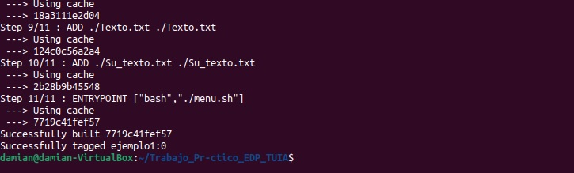
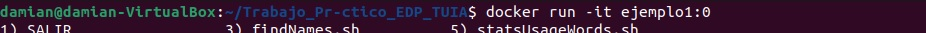

# Trabajo_Pr-ctico_EDP_TUIA
Trabajo práctico de Entorno de Programación
# Reseña
Esta es una aplicación que analiza un archivo de texto dado por el usuario, realiza búsquedas y devuelve resultados estadísticos de cadenas de texto, entre otras funciones
# Instalación y Ejecución
Para la instalación abrir la consola y seguir los siguientes pasos.
# Primer paso
Clonar el repositorio Damian Turco/Trabajo_Pr-ctico_EDP_TUIA ejecutando el siguiente comando:

user@host:~$ git clone https://github.com/DamianTurco/Trabajo_Pr-ctico_EDP_TUIA.git (Enter)

Una vez terminado el proceso, dirigirse al directorio Trabajo_Pr-ctico_EDP_TUIA

user@host:~$ cd Trabajo_Pr-ctico_EDP_TUIA

# Segundo paso
Generar la imagen de la aplicación con el siguiente comando:

user@host:~/Trabajo_Pr-ctico_EDP_TUIA$ docker build -t ejemplo1:0 . (Enter)

donde ejemplo1:0 es un nombre de ejemplo que se le puede indicar a la imagen, seguido de un espacio y un punto.

# Tercer paso
Ejecutar la aplicación con el siguiente comando:

user@host:~/Trabajo_Pr-ctico_EDP_TUIA$ docker run -it ejemplo1:0 (Enter)

donde ejemplo1:0 es el nombre que se le asignó a la imagen en el paso anterior. 
La aplicación ya está lista para iniciar.

# Menú interactivo

Una vez inicializada la aplicación, el menú interactivo muestra las opciones dispuestas de la siguiente manera:

En "Elija un script >" ingrese el número de la opción y luego Enter

*blankLinesCounter: Cuenta las líneas en blanco del texto a analizar
*findNames: Busca y muestra por pantalla los nombres propios con tres o más caracteres
*statsSentences: Muestra la oración mas larga, la más corta y el promedio de longitud de las oraciones del texto a analizar
*statsUsageWords: Muestra un Top Ten de palabras mas usadas en el texto (mínimo de cuatro letras) 
*StatsWords: Muestra la palabra más larga, la más corta, y el promedio de longitud de las palabras del texto.

En "Introduzca el archivo a analizar" escriba el nombre del archivo.
Como muestra, el programa incluye el archivo Texto.txt para ejecutar.

*Ejemplo:
Introduzca el archivo a analizar:
Texto.txt (Enter)

Si desea analizar otro texto, ejecute el siguiente comando:

user@host:~/Trabajo_Pr-ctico_EDP_TUIA$ cp -f path del archivo/archivo Su_texto.txt (Enter)

donde "path del archivo/" es la ruta absoluta del archivo, y "archivo" es el nombre y la extensión del archivo deseado
*Nota: Asegurarse de que el directorio actual sea Trabajo_Pr-ctico_EDP_TUIA y que el destino sea Su_texto.txt[literal]

Una vez realizada esta tarea, repetir el segundo y tercer paso (Instalación y Ejecución). Luego elegir opción del menú interactivo y, en "Introduzca el archivo a analizar", ingrese Su_texto.txt (Enter)
